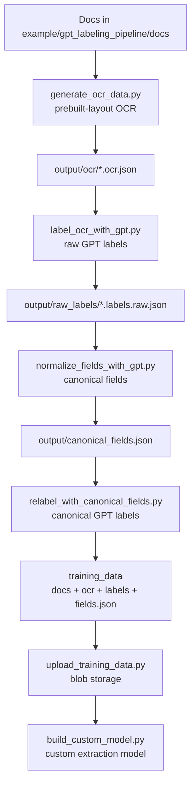

# GPT labeling pipeline example

This example builds an end-to-end labeling flow using OCR + Azure OpenAI to
generate custom extraction training data for Document Intelligence.

## Prerequisites
- Python 3.8 or later
- An Azure Document Intelligence resource
- An Azure OpenAI resource/deployment
- A Blob Storage container for labeled training data

## Setup
1. Install dependencies:

   ```bash
   pip install azure-ai-documentintelligence azure-identity azure-storage-blob python-dotenv openai
   ```

2. Set environment variables (or use a local `.env` file):

   - `DOCUMENTINTELLIGENCE_RESOURCE_GROUP` (for IAM checks)
   - `DOCUMENTINTELLIGENCE_ENDPOINT` or `DOCUMENTINTELLIGENCE_ACCOUNT_NAME`
   - `AZURE_OPENAI_ENDPOINT`
   - `AZURE_OPENAI_API_KEY`
   - `AZURE_OPENAI_DEPLOYMENT` (defaults to `gpt-5.2`)
   - `DOCUMENTINTELLIGENCE_STORAGE_CONTAINER_URL` (including SAS, optional) or
     `DOCUMENTINTELLIGENCE_STORAGE_ACCOUNT_NAME` + `DOCUMENTINTELLIGENCE_STORAGE_CONTAINER_NAME`
   - `DOCUMENTINTELLIGENCE_STORAGE_RESOURCE_GROUP` (for IAM checks, defaults to resource group)
   - `DOCUMENTINTELLIGENCE_STORAGE_PREFIX` (optional)

You can start by copying `example/gpt_labeling_pipeline/.env.example` to `.env`.

Authentication uses `DefaultAzureCredential`, so run `az login` or provide
`AZURE_TENANT_ID`, `AZURE_CLIENT_ID`, and `AZURE_CLIENT_SECRET`.

## Flow
The pipeline expects documents in `example/gpt_labeling_pipeline/docs` and
produces training data in `example/gpt_labeling_pipeline/training_data`.



### Run the full pipeline
```bash
python run_pipeline.py
```

### Step-by-step
```bash
python generate_ocr_data.py
python label_ocr_with_gpt.py
python normalize_fields_with_gpt.py
python relabel_with_canonical_fields.py
python convert_to_studio_format.py
python validate_training_data.py
```

`validate_training_data.py` checks `fields.json`, `*.labels.json`, and `*.ocr.json`
for required fields, allowed data types, and consistency.
Add `--upload` to validate and upload in one step.

Fields are coerced to `string` in `training_data/fields.json` during relabeling.

`convert_to_studio_format.py` overwrites `training_data` with Studio-compatible
artifacts by default (use `--output` to write elsewhere), suitable for
upload/build.
It de-duplicates overlapping bounding boxes to avoid Studio validation errors.

### Validate storage access
```bash
python validate_storage_access.py --use-managed-identity
```

Use `--mi-client-id` for a user-assigned managed identity, or omit the flag to
fall back to `DefaultAzureCredential`. Add `--download` to verify blob read
access.

### Validate storage IAM roles
```bash
python validate_storage_iam.py \
  --resource-group <rg> \
  --docintel-name <docintel-name> \
  --storage-account <storage-account> \
  --container-name <container>
```

`validate_storage_iam.py` checks for the required IAM roles (defaults to
`Storage Blob Data Reader`) at the container or storage account scopes.

### Upload training data
```bash
python upload_training_data.py
```

### Build a custom model
```bash
python build_custom_model.py --build
```

Use `--allow-unlabeled` if the prefix contains extra documents without labels.

## Output folders
- `output/ocr`: OCR results (`*.ocr.json`).
- `output/raw_labels`: GPT-proposed labels per document.
- `output/canonical_fields.json`: Canonical field list from GPT.
- `output/fields.json`: Studio-compatible fields for the canonical list.
- `training_data`: Docs, OCR, labels, and `fields.json` ready for upload.
